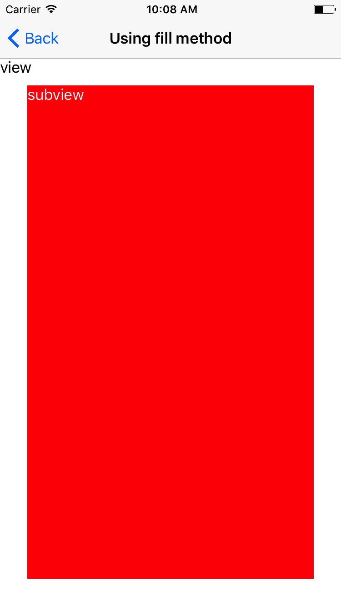
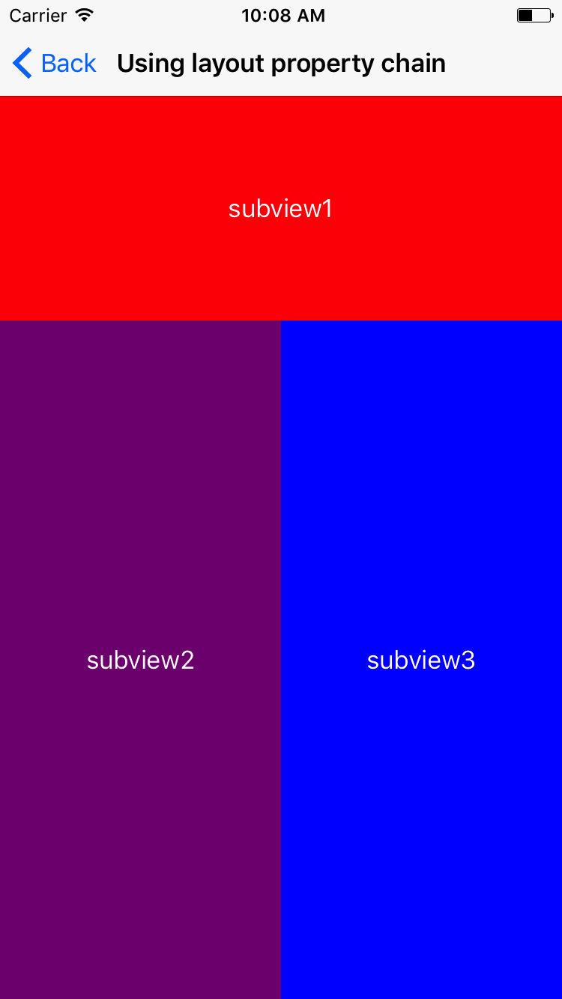

# SimpleLayout

SimpleLayout helps you to using auto layout very easily

[](https://travis-ci.org/pisces/SimpleLayout)
[](http://cocoapods.org/pods/SimpleLayout)
[](http://cocoapods.org/pods/SimpleLayout)
[](http://cocoapods.org/pods/SimpleLayout)

## Example

To run the example project, clone the repo, and run `pod install` from the Example directory first.

### Difference in code

#### Using auto layout with pure iOS SDK
```Swift
let top = NSLayoutConstraint(item: unknownImageView, attribute: .top, relatedBy: .equal, toItem: self, attribute: .top, multiplier: 1.0, constant: -10)
let trailing = NSLayoutConstraint(item: unknownImageView, attribute: .trailing, relatedBy: .equal, toItem: self, attribute: .trailing, multiplier: 1.0, constant: 10)
let width = NSLayoutConstraint(item: unknownImageView, attribute: .width, relatedBy: .equal, toItem: nil, attribute: .notAnAttribute, multiplier: 1.0, constant: 30)
let height = NSLayoutConstraint(item: unknownImageView, attribute: .height, relatedBy: .equal, toItem: nil, attribute: .notAnAttribute, multiplier: 1.0, constant: 30)
            
view.addConstraints([width, height])
view.layoutIfNeeded()
self.addConstraints([top, trailing])
self.layoutIfNeeded()
```

#### Using auto layout with SimpleLayout
```Swift
view.layout
    .top(-10)
    .trailing(10)
    .width(fixed: 30)
    .height(fixed: 30)
```

### To implement auto layout using the fill method
<p valign="top">

</p>

```Swift
import UIKit
import SimpleLayout

class FillExampleViewController: UIViewController {
    
    private lazy var subview: UIView = {
        let label = UILabel()
        label.text = "subview"
        label.textColor = .white
        
        let subview = UIView()
        subview.backgroundColor = .red
        
        subview.addSubview(label)
        label.layout
            .leading()
            .top()
            .width(fixed: 0, relation: .greaterThanOrEqual)
            .height(fixed: 0, relation: .greaterThanOrEqual)
        return subview
    }()
    
    override func viewDidLoad() {
        super.viewDidLoad()
        
        self.edgesForExtendedLayout = .bottom
        
        let label = UILabel()
        label.text = "view"
        
        self.view.addSubview(label)
        self.view.addSubview(subview)

        label.layout
            .leading()
            .top()
            .width(fixed: 0, relation: .greaterThanOrEqual)
            .height(fixed: 0, relation: .greaterThanOrEqual)
        subview.layout.fill(leading: 30, top: 30, trailing: -30, bottom: -30)
    }
}
```

### To implement auto layout using the property chain
<p valign="top">

</p>

```Swift
import UIKit
import SimpleLayout

class ChainExampleViewController: UIViewController {
    
    override func viewDidLoad() {
        super.viewDidLoad()
        
        self.edgesForExtendedLayout = .bottom
        
        let subview1 = label(backgroundColor: .red, text: "subview1")
        let subview2 = label(backgroundColor: .purple, text: "subview2")
        let subview3 = label(backgroundColor: .blue, text: "subview3")
        
        self.view.addSubview(subview1)
        self.view.addSubview(subview2)
        self.view.addSubview(subview3)
        
        subview1.layout
            .leading()
            .top()
            .width()
            .height(fixed: 150)
        subview2.layout
            .leading(by: subview1)
            .top(by: subview1, attribute: .bottom)
            .width(fixed: self.view.width/2)
            .bottom()
        subview3.layout
            .leading(by: subview2, attribute: .trailing)
            .top(by: subview2)
            .trailing()
            .bottom()
    }
    
    private func label(backgroundColor: UIColor, text: String) -> UILabel {
        let label = UILabel()
        label.backgroundColor = backgroundColor
        label.text = text
        label.textAlignment = .center
        label.textColor = .white
        return label
    }
}
```

## Requirements

iOS SDK 8.0 equal or higher

## Installation

SimpleLayout is available through [CocoaPods](http://cocoapods.org). To install
it, simply add the following line to your Podfile:

```ruby
pod "SimpleLayout"
```

## Author

Steve Kim, hh963103@gmail.com

## License

SimpleLayout is available under the MIT license. See the LICENSE file for more info.
